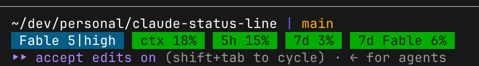

# claude-status-line

A small Rust status-line formatter for Claude Code.

It reads Claude Code status JSON from stdin and prints compact ANSI-colored
segments across two rows. The first row shows the workspace directory (with
the home directory shown as `~`) and the branch; the second row shows:

- model and effort level
- context window usage
- 5-hour and 7-day rate limit usage
- per-model weekly rate limit usage (e.g. Fable), which is tracked
  separately from the all-models 7-day limit

For each rate limit window, the segment label shows the **time remaining
until that window resets** (e.g. `4h12m`, `6d3h`, `<1m`) rather than a fixed
name, so `5h`/`7d`/`7d Fable` become live countdowns. If Claude Code does not
report a reset time for a window, the label falls back to its static name
(`5h`, `7d`, `7d <model>`). The context window has no reset time, so it keeps
its `ctx` label.

The countdown style is configurable via the `CLAUDE_STATUS_LINE_TIME`
environment variable:

- unset or `normal`: two largest non-zero units (`4h12m`, `6d3h`) — the default
- `short`: single largest unit only (`4h`, `6d`)
- `none`: no countdown, static labels only (`5h`, `7d`, `7d <model>`)

Unrecognized values fall back to `normal`. Set it in the `env` section of
`~/.claude/settings.json` to apply it to the status line:

```json
{
  "env": {
    "CLAUDE_STATUS_LINE_TIME": "short"
  }
}
```

Percentage segments are rounded up and colored by usage:

- green: up to 50%
- yellow: up to 80%
- red: above 80%

## Usage

Build and install the binary somewhere on your `PATH`:

```bash
cargo install --path .
```

Then configure Claude Code to use it as a status line in
`~/.claude/settings.json`:

```json
{
  "statusLine": {
    "type": "command",
    "command": "claude-status-line"
  }
}
```

Claude Code passes status JSON on stdin. You can test the formatter locally
with the included fixture:

```bash
claude-status-line < tests/fixtures/schema.json
```

Example output includes ANSI styling and segments like:



```text
~/dev/my-project | worktree-my-feature
Opus|high  ctx 32%  3h12m 81%  5d4h 65%  2d1h Fable 4%
```

### Per-model rate limits

Some models (currently Fable) have their own weekly rate limit that is not
included in the generic `seven_day` bucket. The formatter reads these from
`rate_limits.model_scoped` in the status JSON when present. Claude Code does
not emit that field yet, so as a fallback the formatter reads the usage
snapshot Claude Code caches in `~/.claude.json`
(`cachedUsageUtilization.utilization.limits`). The fallback is only used when
the status JSON contains `rate_limits`, and it disappears automatically once
Claude Code starts sending `model_scoped` itself. Note that the cache key is
an undocumented Claude Code internal and may change between releases; if it
does, the segment is silently omitted.

## Development

```bash
cargo test
cargo run --quiet < tests/fixtures/schema.json
```

## License

MIT
